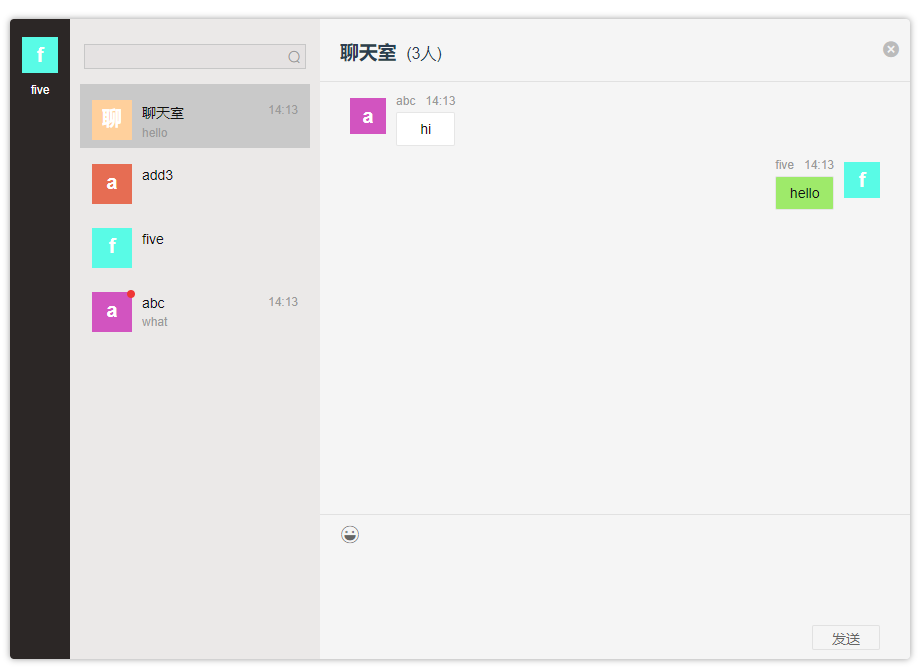

# chartroom

### Vue + Socket.io实现仿wechart的简易聊天室

目前完成了登录退出，多人聊天室，单人聊天，新消息提醒等基本功能，但用户列表还存在一些问题。

## 参考
[基于Node搭建一个聊天室](https://www.jianshu.com/p/1a37a90f2976)

## 步骤
1. 新建一个vue项目：

``` bash
vue init webpack project
```

2. 在项目中新建一个文件夹放服务端，安装服务端依赖：
``` bash
npm install express --save
npm install socket.io --save
```

新建一个server.js创建服务器并监听消息的通信。

``` javascript
const express = require('express');
const app = express();

var http = require('http');
// 用http模块创建一个服务并把express的实例挂载上去
var server = http.Server(app);
// 引入socket.io并立即实例化，把server挂载上去
var io = require('socket.io')(server);

var server = server.listen(4001, function () {
    console.log('服务端启动成功！端口4001');
});
```

其中实现消息通信的关键是:
- 利用socket.io创建io对象
- 通过io的on方法监听事件，emit方法发送事件

启动服务器：
``` bash
node server
```

3. 前端通过socket与服务器通信

## View



## Build Setup

``` bash
# install dependencies
npm install

# serve with hot reload at localhost:8080
npm run dev

# build for production with minification
npm run build

# build for production and view the bundle analyzer report
npm run build --report

# run unit tests
npm run unit

# run e2e tests
npm run e2e

# run all tests
npm test
```

For a detailed explanation on how things work, check out the [guide](http://vuejs-templates.github.io/webpack/) and [docs for vue-loader](http://vuejs.github.io/vue-loader).
